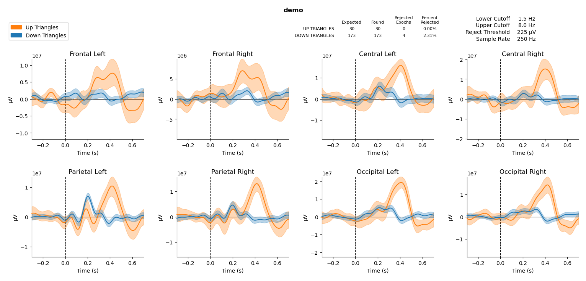

# **Triangle ERP Experiment** <!-- omit in toc -->
### ***By Eliana Neurohr*** <!-- omit in toc -->  
This project strives to showcase the formidable capabilities of computational neuroscience, ensuring accessibility for students, professors, and researchers—even those without prior programming experience.

> ***Note***: *This ReadMe is a work in progress, your patience is appreciated*


<!-- no toc -->
## **Table of Contents** <!-- omit in toc -->
- [**Dependencies**](#dependencies)
- [**Instructions**](#instructions)
  - [**1. Downloading the Code**](#1-downloading-the-code)
  - [**2. Creating the Conda Environment**](#2-creating-the-conda-environment)
    - [**Mac Instructions**](#mac-instructions)
    - [**Windows Instructions**](#windows-instructions)
  - [**Running the Program**](#running-the-program)
  - [**CC Neurophysiology Student Instructions**](#cc-neurophysiology-student-instructions)
- [**EEG Preprocessing**](#eeg-preprocessing)
- [**Artifact Rejection**](#artifact-rejection)
- [**References**](#references)

## **Dependencies**
- [Anaconda](https://www.anaconda.com/download)
- Dependencies in Anaconda environment.yml (installation not required)
  - [Python3](https://www.python.org/downloads/)
  - [mne](https://mne.tools/stable/index.html); full citation below
  - [pandas](https://pandas.pydata.org/)
  - [numpy](https://numpy.org/)
  - [matplotlib](https://matplotlib.org/3.5.3/api/_as_gen/matplotlib.pyplot.html)
  - [datetime](https://docs.python.org/3/library/datetime.html)
---
## **Instructions**  
You need Anaconda downloaded and installed to run this program. Please [download](https://www.anaconda.com/download) if you do not have it already before proceeding. 
### **1. Downloading the Code**  
1. Click the green button that says "Code"
2. Click download zip and extract to a location like your Desktop
  
### **2. Creating the Conda Environment**  
> * The $ before a line which you type into the terminal is not actually typed out in the terminal. This is just to signifiy that the line is to be inputed into the terminal.
> * You should only need to create the Conda environment once; if you've already created the environment, skip to [Running the Program](#running-the-program)
#### **Mac Instructions**
1. Control/right click the ERP folder you just extracted. Hold Option and click "Copy ERP as Pathname"
2. Open a terminal window
3. 
    ```bash
    $ cd <paste pathname you just copied>
    $ conda env create -f environment.yml
    ```
#### **Windows Instructions**
<mark>TODO</mark>

### **Running the Program**  
1. <mark>TODO: format of the data file, move to it to this folder</mark>
2. Start the Conda environment:  
   `$ conda activate ERP_env`
3. Run the program:  
  `(ERP_env) $ python ERP_experiment.py`  
  *Note: You may need to specify that *   <mark>TODO PYTHON3 INSTRUCTIONS</mark>

It may take a moment for the program to start running, especially the first time. After the configurations are loaded, enter your raw data file, ex. ```demo.txt``` and press enter.  
  
The default configuration is to dump the resulting image and cleaned data into an output folder. You can turn this off in the ```config.yml``` file

### **CC Neurophysiology Student Instructions**
<mark>TODO</mark>

---
## **EEG Preprocessing**
1. Trim data down to relevant timeframe based on start and end stimuli signals
2. **FILTERING:** Perform symmetric linear-phase FIR filter using the upper and lower passband edges specified in ```config.yml```
3. **EPOCH ISOLOATION:** Extract epochs from the continuous data using ```t_min``` and ```t_max``` specified in ```config.yml```
4. ***ARTIFACT REJECTION:*** Drop bad epochs using the rejection criteria specified in ```config.yml```  
5. *Since the displayed plot is generated using epochs in order to display the confidence band, epochs are later converted into evoked (averaged epochs) in order to output plotted data to a csv*


## **Artifact Rejection**
<mark>TODO</mark>  
Artifacts are parts of the recorded signal that arise from sources other than the source of interest (i.e., neuronal activity in the brain). These can be caused by a variety of factors, such as electromagnetic field noise from nearby elevators or cell phones, instrument/sensor variation or manlfunctions, or natural biological occurences which cause electrical fluctuations in the brain such as heartbeats, blinks, eye movement, or swallowing.<sup>1</sup>  
  
While artifacts can be rejected or repaired in continous data, it is standard practice in ERP research to reject entire epochs using maximum acceptable peak-to-peak amplitudes. Since different set-ups or hardware will likely be used in repetition of this lab, the reject criteria may require some trial and error and fine tuning in the case of too many/few rejected epochs. This parameter can be modified in ```config.yml```. It may be useful to set the ```rejection_log_level``` to ```DEBUG``` while doing this to see which channels are causing epochs are being rejected.


## **References**
<mark>TODO</mark>  
Experiment inspired by https://docs.openbci.com/Examples/VideoExperiment/  
Code inspiration: https://github.com/OpenBCI/OpenBCI_Experiment

<sup>1</sup> [Overview of artifact detection](https://mne.tools/dev/auto_tutorials/preprocessing/10_preprocessing_overview.html)
