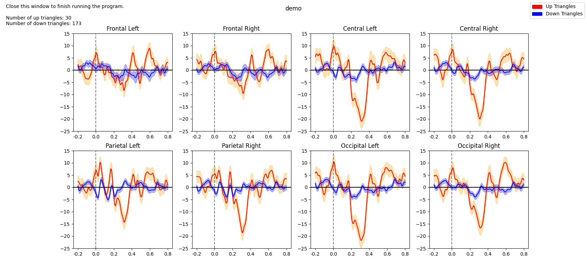

# Triangle ERP Experiment <!-- omit in toc -->
By Eliana Neurohr

<!-- no toc -->
## **Table of Contents** <!-- omit in toc -->
- [**Dependencies**](#dependencies)
- [**Neurophysiology Student Instructions**](#neurophysiology-student-instructions)
  - [**Downloading the Code**](#downloading-the-code)
  - [**Starting Virtual Environment**](#starting-virtual-environment)
  - [**Running the Program**](#running-the-program)
- [**EEG Filtering**](#eeg-filtering)
- [**References**](#references)

## **Dependencies**
- [pandas](https://pandas.pydata.org/)
- [matplotlib](https://matplotlib.org/3.5.3/api/_as_gen/matplotlib.pyplot.html)
- [numpy](https://numpy.org/)
- [scipy](https://docs.scipy.org/doc/scipy/)
  - signal
    - findpeaks
    - butter
    - filtfilt
  - stats
- [datetime](https://docs.python.org/3/library/datetime.html)
- [pickle](https://docs.python.org/3/library/pickle.html)
  - included in Python 3.9.* ; not used in main experiment but useful for testing
- [os](https://docs.python.org/3/library/os.html)

## **Neurophysiology Student Instructions**
This experiment requires Python 3 to be installed. If you do not have Python 3 please download [here](https://www.python.org/downloads/).

***Note**: The $ before a line which you type into the terminal is not actually typed out in the terminal. This is just to signifiy that the line is to be inputed into the terminal*

**If you are doing this experiment on one of the lab computers, skip to [*Starting Virtual Environment*](#starting-virtual-environment)**
****
### **Downloading the Code**
1. Click the green button that says "Code"
2. Click download zip and extract to a location like your Desktop
### **Starting Virtual Environment**
A virtual environment is an environment which can have modules that code needs without having those dependencies installed on your machine.  

Open the Terminal on your computer. Lab computer instructions:
   ```
   $ cd Desktop/ERPLab/
   $ source venv/bin/activate
   ```
   You should see (venv) appear at the far left of the command line now.
### **Running the Program**
First, make sure that the .txt file of the EEG data has been moved into the ERP folder. It is highly recommended that you rename the text file to something more succinct with no spaces, but leave the .txt extension. 
```
(venv) $ python triangles_erp.py
```
You will be prompted to enter the name of the .txt file with the EEG data. You may also try the demo.txt file.
The output CSV and image will be saved in a folder within the ERP folder once the window with the graphs that pops up is closed
## **EEG Filtering**
Details coming...

## **References**
Experiment inspired by https://docs.openbci.com/Examples/VideoExperiment/  
Code inspiration: https://github.com/OpenBCI/OpenBCI_Experiment
